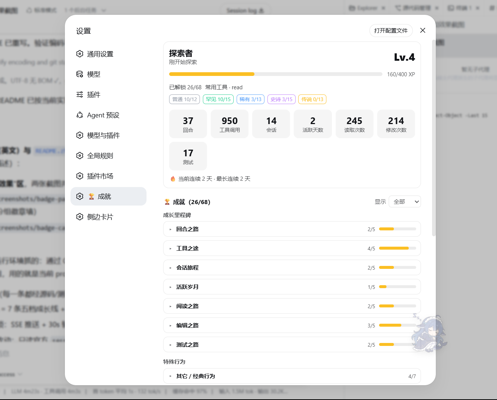
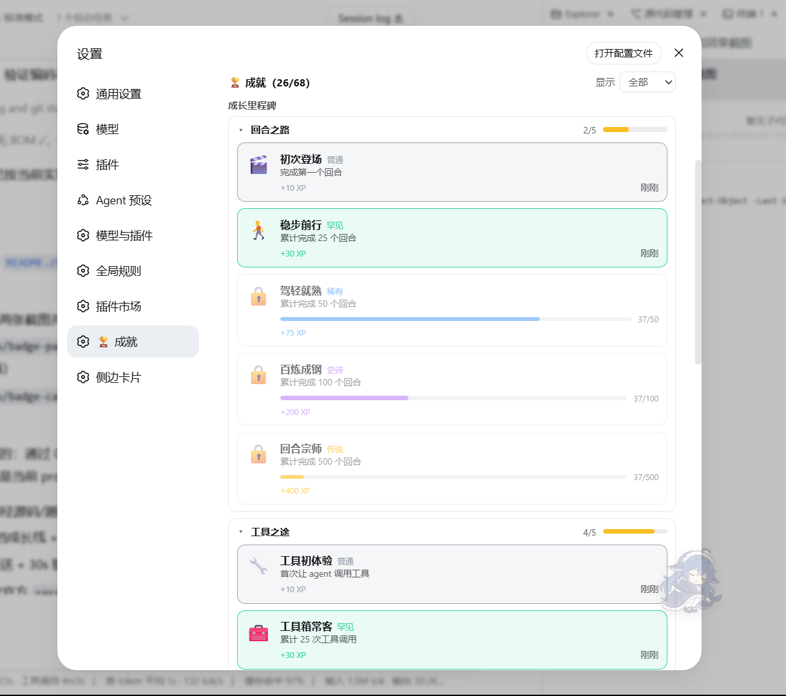

# dsh-achievements 🏆

> **DeepSeek Harness（DSH）** 的游戏化插件：68 个成就横跨七条五档成长线、会话行为徽章与轨迹链——实时解锁 toast、设置页徽章墙、可分享成就卡、Agent Wrapped，以及面向第三方 Pack 的公开 SDK。**零核心改动。**

[English](./README.md) | 简体中文

## 📸 运行效果

| 成就面板：档案卡、稀有度统计、终身计数与分组徽章墙 | 展开的成就卡片：图标、稀有度、描述、进度、XP 与解锁时间 |
|---|---|
|  |  |

## ✨ 亮点

- **68 个成就、三条产品线** —— 七条**五档终身成长线**（稀有度严格 `普通 → 罕见 → 稀有 → 史诗 → 传说`）、10 个**单会话行为徽章**、以及四条额外链上的 20 个**会话轨迹成就**（其中一条完全隐藏）。每次解锁都赚取 XP、提升等级与 persona，并在徽章墙上留下时间戳。
- **实时解锁，无需额外服务** —— 新成就经 **SSE** 实时推送到浏览器，另有 30s 轮询兜底（窗口聚焦/可见时立即刷新）。首次快照只做基线，重装与升级永远不会触发 toast 风暴。
- **零核心改动** —— Host 半只监听官方 `session/event` 事件缝：`turn/end`、`step/start`、`assistant/message`、`step/end`、`tool/call`、`tool/result`，以及 Code Mode 的 `tool/code-dispatch`。全部只读事件，不打核心补丁、不改运行时。
- **纯函数、可独立单测的核心** —— 严格三层流水线：事件**分类器** → 状态 **reducer** → 解锁 **evaluate**。每一层都是纯函数且有独立测试：**19 个测试文件、251 个用例**，全部通过。
- **跨会话持久化、平滑升级** —— v2 状态（`profile` + 会话桶）以 JSON 存在 DSH 主目录；v1 状态无损迁移。终身计数落在 profile 上，不依赖 64 会话保留窗口；升级时缺失计数保守回填为可证明下界，已满足的里程碑在启动时静默补解锁（不走 reducer、不写 session、不广播）。
- **O(1) 轨迹统计** —— P7 会话事实只在低频边界维护（`step/start`、`assistant/message`、`step/end`、settled 工具调用）；逐 token 的 chunk 从不被消费或持久化。
- **隐私安全内建** —— 分享文本、分享卡、Agent Wrapped 与成就链只读聚合计数、成就元数据、persona 与等级；文件路径与命令字符串永不离开引擎。
- **开放 SDK** —— 第三方 Host 插件通过 `ctx.achievements.register` / `registerPack` 注册成就，与内置成就走完全相同的求值路径；重复 id 立即抛错。其它客户端插件经 `ctx.achievementsState` 读取状态。

## 🏅 成就体系（68 个）

成就分两条产品线。**七条长期成长线**各含五档，稀有度严格 `普通 → 罕见 → 稀有 → 史诗 → 传说`（新增里程碑 XP 为 10 / 30 / 75 / 175 / 400）：

| 成长线 | 普通 | 罕见 | 稀有 | 史诗 | 传说 |
|---|---|---:|---:|---:|---:|---:|
| 🎬 回合 | 1 | 25 | 50 | 100 | 500 |
| 🔧 工具调用 | 1 | 25 | 100 | 500 | 2000 |
| 💬 会话 | 1 | 10 | 50 | 200 | 500 |
| 🌅 活跃天数 | 1 | 7 | 30 | 100 | 365 |
| 📖 文件读取 | 10 | 100 | 500 | 2500 | 10000 |
| ✏️ 文件修改 | 1 | 10 | 50 | 250 | 1000 |
| 🧪 测试运行 | 1 | 10 | 50 | 250 | 1000 |

**特殊成就** —— 连续天数（`streak-3` / `streak-7`）、早期额外节点 `ten-turns`，以及 10 个单会话行为徽章：

| 成就 | 条件 |
|---|---|
| 🔁 似曾相识 | 同一文件修改 5 次 |
| 🕳 兔子洞 | 第一次修改前读取 20 个文件 |
| 💣 先斩后奏 | 第一次测试前修改 8 个文件 |
| 🔥 终于通了 | 测试失败 5 次后成功 |
| 🎰 这次一定 | 同一测试命令连续失败 5 次 |
| 🎯 一发入魂 | 只改一次，首次测试即通过 |
| 📚 图书管理员 | 单会话读取 30 个不同文件 |
| 🌱 出门走走 | 单会话工具调用 100 次 |
| 🦴 依赖考古学家 | 读取依赖目录（node_modules / site-packages / vendor）下的文件 |
| 🗿 巨佬模式 | ≤5 次工具调用内完成 读→改→测 且通过 |

**P7 轨迹链**（20 个成就，稀有度严格 `普通 → 罕见 → 稀有 → 史诗 → 传说`，XP 10 / 20 / 40 / 70 / 120）。只读低频边界，不逐 token 持久化：

| 链 | 指标 | 五档阈值 |
|---|---|---|
| 💬 会话马拉松 | 单会话完成回合数（按有 closed step 的 distinct turn 计） | 5 / 20 / 50 / 100 / 200 |
| 🪜 单轮深潜 | 单回合内关闭的步骤数（按 `step/end` 计） | 5 / 20 / 50 / 100 / 500 |
| 🔧 工具齐射 | 单步骤内 settled 工具调用数（含 Code Mode 子调用） | 5 / 10 / 25 / 50 / 100 |
| ⏳ 时间异象 | 单次模型请求思考耗时（`step/start → assistant/message`，隐藏彩蛋） | 30s / 100s / 300s / 500s / 1000s |

## ⚙️ 架构

```
DSH session/event（turn/end、step/start、assistant/message、step/end、tool/call、tool/result、tool/code-dispatch）
  → src/events.ts        分类器    — 原始 payload → 标准化 AchievementEvent + ToolSummary
  → src/reducer.ts       reducer   — 纯 reduceState：profile 计数 + 会话行为 + P7 轨迹事实
  → src/achievements.ts  evaluate  — applyEvent：buildContext + 对每个未解锁 def 求值
  → src/index.ts         Host      — 持久化 JSON → SSE 推送（unlock）+ 只读 HTTP API；启动静默 reconcile
  → src/client/          Browser   — EventSource + 30s 轮询 → 徽章墙 + 解锁 toast
```

三层完全解耦、可独立单测；规则层永远不直接读 Harness 的 tool payload。浏览器 bundle 只能运行时 import 浏览器安全的模块（`tsdown.config.ts` 的纯度门禁会拦截任何 `node:*` 越界导入）。

## 📦 安装

前置：DSH（`dsh web` 可运行）、Node ≥ 22.19。

```bash
# GitHub 安装（预构建 lib/ 已提交，无需 allowBuilds）
dsh plugin --profile web add "github:luumod/dsh-achievements#main"

# 本地目录安装（Windows 上 npm pack 最稳，别用 `link:`）
cd dsh-achievements && npm install --legacy-peer-deps && npm run build
npm pack --ignore-scripts
dsh plugin --profile web add "<绝对路径>\dsh-achievements-0.1.0.tgz"
```

安装后**重启 `dsh web`**，然后正常使用——完成第一个回合即解锁第一个成就（所有统计走官方事件缝，正常对话即可）。

## 🎮 使用

1. 正常对话、让 agent 干活——回合、工具调用、新会话、每日活跃都会静默累计；解锁新成就时右下角弹出 toast（带稀有度配色、XP 与风味文本）。
2. **设置 → 🏆 成就** 展示完整体验：
   - **档案卡** —— persona、等级与 XP 进度、已解锁/总数、常用工具与稀有度分布；
   - **终身计数** —— 回合 / 工具调用 / 会话 / 活跃天数 / 读取 / 修改 / 测试，外加当前与最长连续天数；
   - **徽章墙** —— 按七条成长路线与特殊/轨迹链折叠，组 header 直接显示进度条；支持"全部 / 未解锁 / 已解锁"筛选；已解锁带时间戳、未解锁置灰，隐藏成就未解锁时仅显示 `???`；
   - **会话战报** —— 最近会话的回合、步骤、最深单轮、工具调用与读/改/测拆分；
   - **🎁 Agent Wrapped** 与 **📤 分享** —— 本地、私密的年度总结与可分享成就卡。

## 🔌 开发者：`ctx.achievements` SDK

从宿主插件注册自定义成就——内置与第三方 Pack 共享同一条求值路径与同一个 registry（重复 id 抛错）：

```ts
export const inject = ['achievements']

export function apply(ctx: Context): void {
  ctx.achievements.register({
    id: 'python-first-run',
    icon: '🐍',
    title: { zh: '蟒蛇出洞', en: 'First Python Run' },
    description: { zh: '首次运行 Python', en: 'Run Python for the first time' },
    rarity: 'uncommon',
    xp: 20,
    scope: 'session',
    evaluate: ctx => ({ unlocked: ctx.session.toolCalls >= 1 }),
  })
}
```

也可注册整个 Pack：`ctx.achievements.registerPack({ id, version, name, achievements })`。注册即 reconcile——已满足的 lifetime Pack 无需等待下一个实时事件即可解锁。完整指南见 `docs/SDK.md`，可运行示例见 `examples/python-pack.ts`。

浏览器侧，其它客户端插件通过 `ctx.achievementsState.refresh()` / `ctx.achievementsState.unlockedIds()` 读取状态。

## 🛠️ 本地开发

```bash
npm install --legacy-peer-deps
$env:DSH_NODE_MODULES = "$env:USERPROFILE\.dsh\profiles\node_modules"   # PowerShell；本地运行时 symlink
npm run setup:dsh-workspace
npm run verify     # ★ 一键门禁：clean + typecheck + test + build（含浏览器纯度门禁）
npm test           # vitest — 19 文件 / 251 用例（引擎规则、连击、幂等、SDK、manifest…）
```

> 注：若 `npm run build` 报 `Failed to import module "unrun"`，先执行一次 `npm install --no-save unrun`（tsdown optional peer，建议 Node ≥ 22.19）。

## 📁 目录结构

```
dsh-achievements/
├── package.json            # dsh.bundle.patch + dsh.client 双契约
├── cordis.patch.yml        # bundle 补丁层
├── tsdown.config.ts        # client bundle + 浏览器纯度门禁
├── scripts/                # build / clean / setup-dsh-workspace / verify
├── docs/SDK.md             # 第三方作者指南
├── examples/python-pack.ts # 可运行的示例 Pack
├── src/
│   ├── index.ts            # Host 半：事件接线、registry、持久化、HTTP + SSE、SDK
│   ├── events.ts           # ★ 事件分类器（标准化 AchievementEvent + ToolSummary）
│   ├── reducer.ts          # ★ 纯 reducer（reduceState / buildContext）
│   ├── achievements.ts     # ★ 纯引擎（applyEvent）+ 领域模型 + 68 个内置成就
│   ├── state.ts            # State v2（profile + sessions）、迁移、JSON 持久化
│   ├── sdk.ts              # createAchievementRegistry + AchievementPack
│   ├── gamification.ts     # levelOf / xpForLevel / RARITY_META（浏览器安全）
│   ├── profile.ts          # Profile ViewModel + persona + 稀有度汇总（浏览器安全）
│   ├── share.ts            # 分享卡 / Agent Wrapped / 成就链（浏览器安全、隐私安全）
│   ├── api.ts              # API 路径常量 + SSE 帧格式（浏览器安全）
│   └── client/             # 浏览器半
│       ├── index.ts        # apply：ctx.achievementsState + 轮询 + SSE + 槽位注入
│       ├── achievements-client.ts  # 状态 HTTP client
│       ├── badge-panel.tsx # 徽章墙（settings.section），分组源自链模型而非硬编码
│       ├── toast.ts        # 解锁 toast（零依赖 DOM）
│       └── unlock-tracker.ts  # toast 基线去重（纯函数）
└── tests/                  # 19 个 spec：classifier / reducer / evaluate / state / SDK / 链…
```

## 🧩 生态定位

- **填补空白** —— DSH 生态此前无统一成就/徽章系统（社区调研明确点名"暂无真正游戏化任务/成就/等级系统"）。
- **与 `dsh-soundscape` 同一套双面包范式** —— Host 走官方事件缝驱动纯引擎；浏览器半是 client 插件（`settings.section` + 状态轮询）。
- **零核心改动** —— 只读事件 + 自有状态文件 + `ctx.effect` 注册。本仓库是 [Blaczz/dsh-achievements](https://github.com/Blaczz/dsh-achievements) 的 fork，在其基础上扩展了行为 + 轨迹成就、SDK 与分享层。

## ⚖️ License

MIT © 2026 Blaczz（上游）。独立社区插件，与 [DeepSeek Harness](https://github.com/deepseek-ai/deepseek-harness) 无关。
